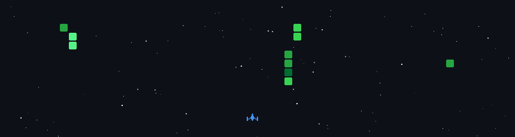

<h1 align="center">
    
</h1>

<h3 align="center">A passionate software developer from Delhi</h3>

 

 
 🔭 I’m currently working on **My Portfolio**
 
 🌱 I’m currently learning **Docker, AWS**

💬 Ask me about **Node.js, React, Firebase... or anything [here](https://github.com/Abhyudaysharma/Abhyudaysharma/issues)**

⚡ Fun fact **My Git commits are just me arguing with myself in timestamps.**

 
   

  

 

 
<h2 align="center">⚒️ Languages-Frameworks-Tools ⚒️</h2>
 

    
     

 

  <h2>🐍 My Contributions 🐍</h2>
   
   
  
     

<h2 align="center">⚡ Stats ⚡</h2>
 

  

<!--

  
  
   
  
    -->

## 🎮 Space Shooter 🎮

  

<h3 align="center">
    
</h3>

 

<!--## Hi there 👋

<!--
**Abhyudaysharma/Abhyudaysharma** is a ✨ _special_ ✨ repository because its `README.md` (this file) appears on your GitHub profile.

Here are some ideas to get you started:

- 🔭 I’m currently working on ...
- 🌱 I’m currently learning ...
- 👯 I’m looking to collaborate on ...
- 🤔 I’m looking for help with ...
- 💬 Ask me about ...
- 📫 How to reach me: ...
- 😄 Pronouns: ...
- ⚡ Fun fact: ...
-->
